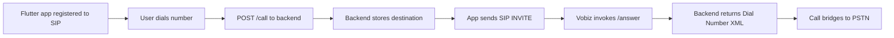

# vobiz_final

Single-folder setup for Vobiz calling with:

- Node backend (`Vobiz-RTC-demo`) exposing `/call`, `/answer`, `/hangup`
- Flutter SIP/WebRTC app (`_zipinspect/vobiz_flutter`)
- Flutter SDK package scaffold (`packages/vobiz_webrtc`)
- Demo app for package (`apps/vobiz_demo`)

## What this variant is for

This variant is best for outbound-focused testing and development.

## Prerequisites

1. Node.js 18+ and npm
2. Flutter SDK 3.10+
3. Android Studio/Xcode toolchains (as needed)
4. A physical Android/iOS device for media testing
5. Vobiz account with endpoint credentials
6. ngrok (for public Answer URL testing)

## Required configuration

Create local backend env file:

```powershell
cd .\vobiz_final\Vobiz-RTC-demo
Copy-Item .env.example .env
```

Set values in `.env`:

```env
CALLER_ID=+<your-vobiz-number>
DEFAULT_DESTINATION=+<optional-fallback-destination>
```

## Run guide

### Terminal 1 - Backend

```powershell
cd C:\Users\dk013\Desktop\sdk\vobiz_final\Vobiz-RTC-demo
npm install
npm start
```

### Terminal 2 - Expose backend (optional but recommended)

```powershell
ngrok http 3000
```

In Vobiz Console, set:

- Answer URL: `https://<ngrok-url>/answer`
- Hangup URL: `https://<ngrok-url>/hangup`

### Terminal 3 - Flutter app

```powershell
cd C:\Users\dk013\Desktop\sdk\vobiz_final\_zipinspect\vobiz_flutter
flutter pub get
flutter devices
adb reverse tcp:3000 tcp:3000
flutter run -d <device-id> --dart-define=VOBIZ_BACKEND_URL=http://127.0.0.1:3000
```

Optional overrides:

```powershell
flutter run -d <device-id> `
  --dart-define=VOBIZ_BACKEND_URL=http://127.0.0.1:3000 `
  --dart-define=VOBIZ_WS_URL=wss://registrar.vobiz.ai:5063/ `
  --dart-define=VOBIZ_SIP_SERVER=registrar.vobiz.ai `
  --dart-define=VOBIZ_CALLER_ID=+<your-vobiz-number>
```

### Terminal 4 - Web demo (optional)

```powershell
cd C:\Users\dk013\Desktop\sdk\vobiz_final\Vobiz-RTC-demo
npm run client
```

Open: `http://localhost:8080`

## Outbound call workflow



## Verification checklist

1. App logs in and shows registered state
2. Dialer accepts destination number
3. Backend logs show `POST /call`
4. Backend logs show `/answer` request
5. Call transitions: Calling -> Ringing -> In Call

## Notes

- Do not commit `.env`, real credentials, ngrok URLs, or personal phone numbers.
- Keep `CALLER_ID` and destination different (self-call is blocked).
- For full inbound-focused behavior and additional inbound routing details, use `vobiz_inbound`.

