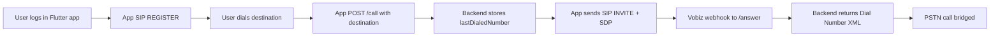
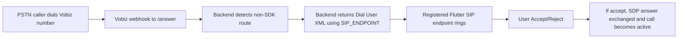
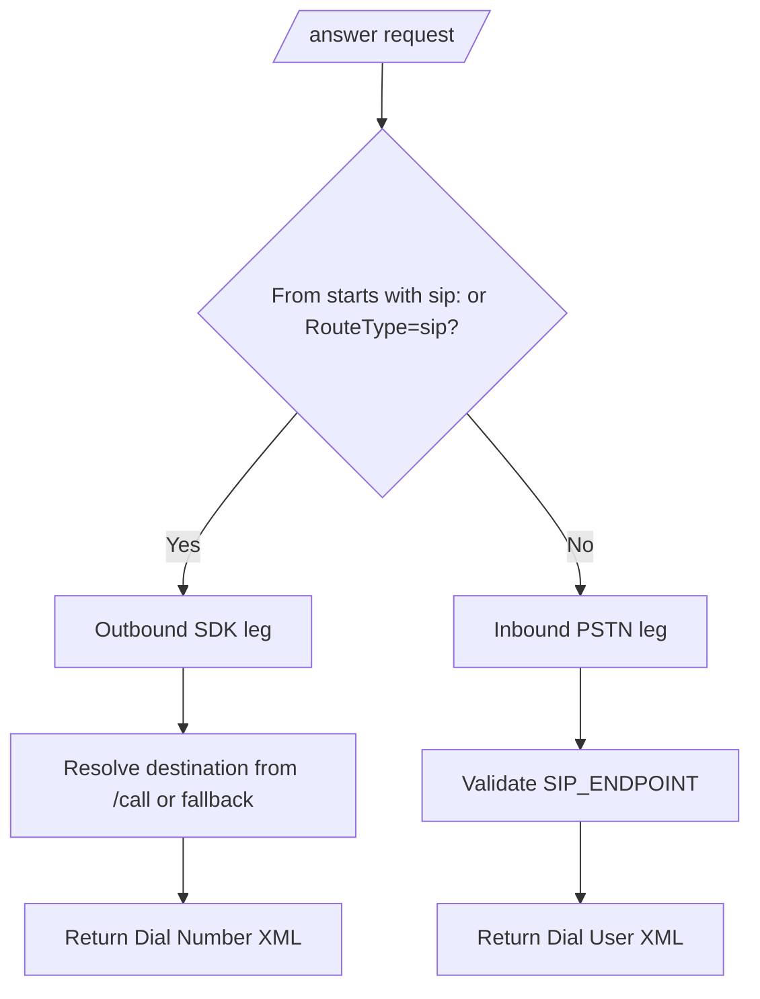

# vobiz_inbound

Unified Vobiz setup for both outbound and inbound calling.

This folder contains:

- `Vobiz-RTC-demo` - Node backend with `/call`, `/answer`, `/hangup`, `/register-token`
- `_zipinspect/vobiz_flutter` - primary Flutter SIP/WebRTC app
- `packages/vobiz_webrtc` - reusable Flutter SDK scaffold
- `apps/vobiz_demo` - demo app wired to the package

## What this variant is for

Use `vobiz_inbound` when you want:

1. Outbound PSTN calls from Flutter
2. Inbound PSTN-to-app call routing through SIP endpoint
3. Single backend handling both directions

## Prerequisites

1. Node.js 18+ and npm
2. Flutter SDK 3.10+
3. Android SDK / iOS toolchain
4. Physical mobile device for call/media testing
5. Vobiz account with:
   - purchased/verified caller number
   - endpoint username/password
6. ngrok (or any public tunnel) for webhook URLs

## Required configuration

Create env file:

```powershell
cd .\vobiz_inbound\Vobiz-RTC-demo
Copy-Item .env.example .env
```

Set real values in `.env`:

```env
CALLER_ID=+<your-vobiz-number>
SIP_ENDPOINT=sip:<your-endpoint-username>@registrar.vobiz.ai
DEFAULT_DESTINATION=+<optional-test-destination>
DEFAULT_COUNTRY_CODE=91
```

Meaning:

- `CALLER_ID`: outbound caller ID used in `<Dial callerId="...">`
- `SIP_ENDPOINT`: where inbound PSTN calls are routed (`<Dial><User>...`)
- `DEFAULT_DESTINATION`: fallback outbound destination when none is posted

## Run instructions (terminal-by-terminal)

### Terminal 1 - Backend

```powershell
cd C:\Users\dk013\Desktop\sdk\vobiz_inbound\Vobiz-RTC-demo
npm install
npm start
```

### Terminal 2 - Public webhook tunnel

```powershell
ngrok http 3000
```

Use ngrok URL in Vobiz Console:

- Answer URL: `https://<ngrok-url>/answer`
- Hangup URL: `https://<ngrok-url>/hangup`

### Terminal 3 - Flutter app (`_zipinspect/vobiz_flutter`)

```powershell
cd C:\Users\dk013\Desktop\sdk\vobiz_inbound\_zipinspect\vobiz_flutter
flutter pub get
flutter devices
adb reverse tcp:3000 tcp:3000
flutter run -d <device-id> --dart-define=VOBIZ_BACKEND_URL=http://127.0.0.1:3000 --dart-define=VOBIZ_CALLER_ID=+<your-vobiz-number>
```

Optional SIP overrides:

```powershell
flutter run -d <device-id> `
  --dart-define=VOBIZ_BACKEND_URL=http://127.0.0.1:3000 `
  --dart-define=VOBIZ_WS_URL=wss://registrar.vobiz.ai:5063/ `
  --dart-define=VOBIZ_SIP_SERVER=registrar.vobiz.ai `
  --dart-define=VOBIZ_CALLER_ID=+<your-vobiz-number>
```

### Terminal 4 - Optional web demo client

```powershell
cd C:\Users\dk013\Desktop\sdk\vobiz_inbound\Vobiz-RTC-demo
npm run client
```

Open: `http://localhost:8080`

## Workflow and call flows

## Outbound flow (Flutter -> PSTN)



## Inbound flow (PSTN -> Flutter)



## Backend decision flow for `/answer`



## Testing both directions

1. Start backend and tunnel.
2. Start app and log in using Vobiz endpoint credentials.
3. **Outbound test**:
   - Enter E.164 number in app
   - Tap Call
   - Confirm backend logs show `POST /call` and `/answer`
4. **Inbound test**:
   - Keep app registered/online
   - Dial your Vobiz number from external phone
   - Confirm incoming screen appears in app
   - Accept and verify media

## Push notification details (inbound)

Current project status:

1. Backend exposes `POST /register-token`.
2. Endpoint stores push tokens in-memory (`registeredPushTokens` map).
3. There is **no APNs/FCM dispatch implementation** in this repo yet.
4. Flutter app in `_zipinspect/vobiz_flutter` currently relies on active SIP registration for inbound ringing.

So, inbound ringing works while app is connected/registered. Full background wake-up push flow is scaffolded at API level (`/register-token`) but not fully implemented end-to-end.

## Key endpoints

- `POST /call` - store outbound destination
- `GET|POST /answer` - return Vobiz XML for outbound/inbound routing
- `GET|POST /hangup` - return empty XML
- `POST /register-token` - store username/push-token pair (in-memory)

## Safety and operational notes

1. Do not commit `.env` or real credentials.
2. Do not commit real phone numbers or ngrok URLs.
3. Keep caller ID and destination different (self-call blocked).
4. Use physical devices for reliable WebRTC audio tests.

